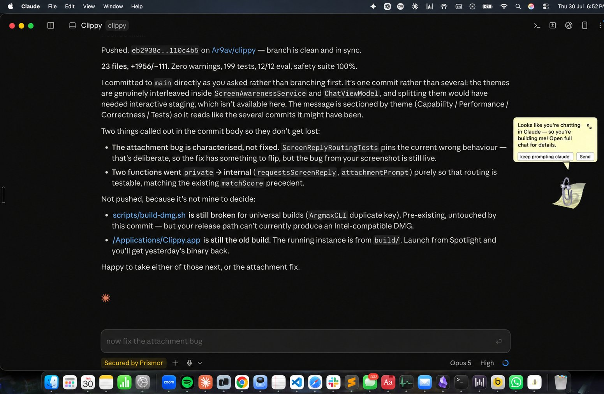

<div align="center">
  

  # Clippy for macOS

  ### The paperclip grew up. It can see your screen now — and click things.

  Ask it to do something on your Mac and it takes a screenshot, reads the
  accessibility tree of whatever's in front of you, and **does it** — instead
  of describing the steps back to you and leaving you to click.

  [](https://github.com/Ar9av/clippy/releases/latest)

  
  
  
  
  

  <br />

  

  <sub><i>Clippy, live on the desktop, working out on making itself</i></sub>
</div>

---

## Why you'd want this

Most "AI desktop assistant" demos stop at chat: you ask, it answers, and
**you** still do the clicking. Clippy closes that last gap. It's the
difference between:

> *"To turn on Dark Mode, open System Settings, click Appearance in the
> sidebar, then choose Dark."*

and Clippy just **doing it** while you watch the checklist tick over.

It lives as a small floating paperclip on your desktop: short answers come
back in the speech balloon, and the full chat window opens underneath it for
longer conversations, spoken replies, dictation, and file attachments. The
classic assistant experience, minus the 90s bugs.

### Things you can actually say to it

| You say | What happens |
| --- | --- |
| *"turn on dark mode"* | Opens System Settings, finds Appearance, clicks Dark. |
| *"search GitHub for swift accessibility"* | Focuses the browser's address bar, types, submits. |
| *"what does this error mean?"* | Reads the error off your screen and explains it. No copy-paste. |
| *"reply to this"* | Reads the visible conversation, drafts a reply into the box — **never sends it**. |
| *"put that in the prompt box"* | Types the thing you just discussed into the field you meant. |
| *"summarise this page"* | Scrolls, reads, answers in the balloon. |
| *"write a haiku about paperclips"* | Just answers — no screenshot taken, streams in instantly. |

> [!IMPORTANT]
> Clippy stops before anything **irreversible**. Send, Submit, buy, pay,
> delete, agree, and every password field are refused unconditionally — it
> gets you to the last step and hands you the keyboard. See
> [Guardrails](#guardrails).

## Install

1. **[Download the latest DMG](https://github.com/Ar9av/clippy/releases/latest)** — one universal build, Apple Silicon and Intel.
2. Open it, drag Clippy to Applications.
3. First launch: right-click ▸ **Open** (the build is ad-hoc signed, so Gatekeeper warns once).
4. Grant **Accessibility** and **Screen Recording** when asked. Without them Clippy still chats, it just can't see or act.

Then pick how it thinks, in Settings: your existing **Claude Code** or
**Codex** login (no extra key needed), or your own **OpenAI** / **Anthropic**
API key, stored in the macOS Keychain.

## How it works

Every screen request runs the same loop, one step at a time:

```
 look  ──▶  plan one step  ──▶  do it  ──▶  look again  ──▶  done?
   ▲                                                          │
   └──────────────  no: what changed? re-plan  ◀──────────────┘
```

It never builds a ten-step plan up front and runs it blind — a real screen
rarely matches a prediction, and looking again after every action is how
Clippy notices.

<details>
<summary><b>The details that make it work</b> (click to expand)</summary>

<br />

- **Looks when it matters, and only then.** A request that could be about
  your screen gets a fresh screenshot plus an accessibility scan — control
  labels, roles, positions, and each control's current state. A
  self-contained question ("explain tail recursion") skips the capture
  entirely and streams the answer instead. If a skipped look turns out to
  have been needed, Clippy notices from its own answer and retries with real
  screen context, so a miss costs a second, not a wrong answer.
- **Reads state, not just labels.** Every control reports what's already in
  it — the text sitting in a field, whether a checkbox is on or off, what
  currently has keyboard focus. That's what stops it retyping a search box
  that already holds the right query, or toggling a setting that was already
  on, and it's how it confirms a step did what it intended.
- **Scrolls to find things.** An accessibility scan only ever describes
  what's on screen right now, so a control below the fold looks exactly like
  a control that doesn't exist. Clippy can scroll and look again — a few
  ticks at a time, re-observing between them — instead of concluding the
  target isn't there.
- **Retries on its own.** A failed step (wrong label, a menu that opened
  somewhere else) triggers an automatic retry from a fresh screenshot,
  bounded to a few consecutive attempts before it stops and asks you.
- **Clicks and types by coordinate when labels can't be trusted.** Browser
  address bars are the classic case: their accessibility label varies by
  version, and a page can have a look-alike search box with the exact same
  placeholder text sitting right next to the real one. Clippy can click the
  literal pixel it sees in the screenshot instead of gambling on a label
  match.
- **Aware of what's already open.** Before launching a fresh app instance,
  it checks what's already running and prefers switching to it.
- **Shows its work.** Every plan runs through a live checklist (✓ done,
  ✗ failed, • pending) and, once it finishes, gets posted to the chat
  transcript as a permanent record of what actually happened.
- **Remembers you.** Tell it your name, what you're building, or how you
  like answers, and it carries that across chats and relaunches instead of
  asking again on Monday. Everything it has stored is listed verbatim in
  Settings ▸ *What Clippy remembers*, and deletable one line at a time —
  memory you can't see is memory you can't correct.

</details>

## The name

The paperclip is a nod to Microsoft's old Office Assistant. Everything
else — the screen reasoning, the safety checks, the retry logic — is
original.

It's a solo side project, rebuilt in public commits as bugs turned up from
using it day to day. Most of the interesting work is in getting the
automation to **fail safely**: a step that can't find its target should stop
and ask, not click something at random.

## Project structure

```
Sources/
  ClippyCore/                    Shared library: providers, prompts, safety. No UI, no AppKit.
    AIService.swift              Provider-agnostic prompt building and response marker parsing.
    AnthropicClient.swift        Real Anthropic tool-use client with streaming.
    Models.swift                 ChatMessage, ScreenPlanStep, PendingScreenPlan, and friends.
    ScreenPlanRunner.swift       Runs a validated plan step by step against ScreenStepPerforming.
    ScreenAgent.swift            Observe, act, verify loop for tool-use screen intent.
    AIProviding.swift            AIProviding protocol plus the CLI-backed and API-backed providers.
    ClippyTools.swift            Tool-use schema definitions for model-driven screen actions.
    ScreenTypes.swift            ScreenContext, ScreenElementSummary, and screenshot metadata.
    AutomationSafety.swift       Final-action refusal list: send, submit, pay, delete, and so on.
    CoordinateSpace.swift        Shared math for correcting model-supplied screen points.
    KeychainStore.swift          API key storage.
    SystemPrompt.swift           Shared system prompt text.

  ClippyMac/                     The app: SwiftUI, AppKit, macOS Accessibility.
    ContentView.swift            The floating balloon, expanded chat window, and Settings.
    ScreenAwarenessService.swift Accessibility-tree scanning, clicking, and typing.
    ChatViewModel.swift          Central state machine driving every request and screen action.
    ScreenTypingService.swift    Live-tracks the last focused editable field for direct insertion.
    LocalActionService.swift     Discovers local Claude Code and Codex sessions to resume.
    ClippyMacApp.swift           App entry point, window configuration, permissions bootstrap.
    ChatStore.swift              Conversation, history, and pending-plan persistence.
    MemoryStore.swift            Durable facts about you, carried across chats and relaunches.
    AmbientContext.swift         Time, day, and frontmost app — awareness that costs no screenshot.
    SpeechService.swift          Dictation and spoken replies, including the optional local Whisper engine.
    ListeningIndicatorView.swift Animated waveform and pulse shown while dictation is listening.
    PushToTalkMonitor.swift      Hold-to-talk chord tracking for both dictation routes.
    CustomPrompt.swift           User-defined slash commands and their parsing.
    BalloonAction.swift          The balloon menu's rows, ordering, and visibility.
    OnboardingView.swift         First-run permissions primer.
    PermissionsModel.swift       Live Accessibility and Screen Recording permission state.
    ClippySpriteView.swift       Sprite-sheet animation and the floating character's on-screen look.

  ClippyEval/                    Offline regression harness for the tool-use screen-intent path.

Tests/ClippyMacTests/            Unit tests: plan running, tool-use parsing, safety, persistence.
scripts/build-dmg.sh             Universal-binary build, code signing, and DMG packaging.
```

## Guardrails

- Every step is validated before it runs: **Send, Submit, publish, buy, pay,
  delete, accept or agree, sign out, and password or passcode controls are
  always refused.** This check is unconditional and independent of
  everything else below.
- Return is never sent by Clippy, with exactly one exception: submitting a
  browser's own address or search field (navigating to a URL or running a
  search). Every other field gets typed into but never submitted; you press
  Enter yourself.
- Secure and password fields are refused outright, regardless of what's
  asked.
- Scrolling is the one action that runs without confirmation: it only
  changes what's visible, commits nothing, and destroys nothing. It still
  refuses to scroll a restricted app, since that's still synthetic input
  aimed at one.
- By default, this build's terminal and agent-CLI restriction is **off**
  (`gui-restricted-app`, `enabled: false`): Clippy can click and type into
  Terminal, Warp, iTerm, and similar apps, on the reasoning that everything
  runs on your own machine and Return still can't be sent there. Flip that
  one flag to restore it.
- Nothing runs without both **Accessibility** and **Screen & System Audio
  Recording** permission granted in System Settings. Clippy prompts for both
  the first time it needs them.

### The rules are a Prismor policy, not Swift

Every refusal above comes from
[`Resources/prismor-policy.yaml`](Resources/prismor-policy.yaml) — a
[Prismor Warden](https://prismor.dev) policy file. `AutomationSafety.swift`
holds no rule text any more; it asks the policy and reports the answer. So
changing what Clippy will and won't touch is a diff to a YAML file, reviewable
on its own, with no rebuild of anyone's mental model of the Swift.

```yaml
- id: gui-final-action
  severity: CRITICAL
  category: final_action
  title: Control performs a consequential, non-reversible action
  event_types: [ui_action]
  fields: [control_label]
  mode: enforce
  patterns: ['\bsend\b', '\bsubmit\b', '\bbuy\b', '\bdelete\b', ...]
```

After editing, recompile the form the app loads (CI fails the build if you
forget):

```bash
./scripts/compile-policy.sh
```

**It fails closed.** A policy that's missing, corrupt, or contains a regex
that won't compile does not degrade into "allow" — Clippy treats every
control as a final action and stops touching the screen entirely. A guardrail
that quietly stops guarding is worse than one that visibly stops working.

> [!NOTE]
> Clippy's dangerous act is *"operate the control labelled Send"*, which
> Warden's original `event_types` enum couldn't express — it described agents
> that run commands and edit files (`shell`, `file_read`, `network`, …). These
> rules use a `ui_action` event type with `control_label` / `ax_role` /
> `app_name` / `typed_text` fields, [contributed
> upstream](https://prismor.dev) along with the `type: veto` allowlist
> precedence the address-bar exception depends on. Everything else — severity,
> `mode`, `add_patterns` / `disable_patterns` and their strengthen-only
> semantics — is stock and implemented to match, and the same file loads
> identically in Warden and in Clippy.

## Build it yourself

Prefer not to trust a stranger's DMG? Fair. Requirements: macOS 14+, Xcode
command-line tools, and Swift 5.10+.

```bash
chmod +x scripts/build-dmg.sh
./scripts/build-dmg.sh
```

The output is written to `build/Clippy-macOS-universal.dmg`. The included app
runs natively on both Apple Silicon and Intel Macs.

Local builds automatically use the first Apple Development code-signing
identity in the current keychain. This keeps macOS Accessibility permission
stable across rebuilds. If no development identity is available, the script
falls back to ad-hoc signing.

For public distribution without Gatekeeper warnings, set a Developer ID
identity before building:

```bash
CODESIGN_IDENTITY="Developer ID Application: Your Name (TEAMID)" ./scripts/build-dmg.sh
```

Then notarize the resulting DMG with your Apple Developer credentials and
staple the ticket.

Published releases are built the same way by
[`.github/workflows/release.yml`](.github/workflows/release.yml), which runs
the tests and the offline safety eval first and refuses to ship a DMG that
lost either architecture slice.

Run the checks yourself with:

```bash
swift test                    # 280 unit tests
swift run clippy-eval --offline   # replays recorded screens; safety regression gate
```

## Provider setup

### Claude Code

Install Claude Code and authenticate once in Terminal. Clippy finds common
Homebrew, npm, and user-local install locations and runs `claude -p`.

### Codex

Install Codex and authenticate once in Terminal. Clippy runs `codex exec` with
network and file mutation disabled by the `read-only` sandbox.

### APIs

Select OpenAI API or Anthropic API in Settings, enter a model and API key, then
click **Save key**. Keys never enter app preferences; they are stored in the
user's macOS Keychain.

## Other features

- **Slash commands.** `/clear` clears the chat and starts a new session,
  `/help` lists everything. Save prompts you use often as your own commands in
  Settings ▸ Custom prompts — anything typed after the command is appended, so
  `/review this function` works as well as a bare `/review`. Typing `/` shows
  the matching commands above the composer.
- **An editable balloon menu.** The floating paperclip's options can be
  renamed, reordered, or hidden in Settings ▸ Balloon menu, and any custom
  prompt can be surfaced there as a one-click row. Each built-in row keeps its
  behaviour — only the wording is yours.
- **Follows your active display.** On a multi-monitor setup Clippy moves to
  whichever screen holds the app you just switched to, keeping its relative
  position, and recovers itself if the display it was on is unplugged.
- Spoken replies and microphone dictation, with an optional local Whisper
  engine (inspired by [OpenWhispr](https://github.com/OpenWhispr/openwhispr))
  for more accurate, fully offline transcription — off by default, offered
  once at first launch and toggleable any time in Settings
- **Push-to-talk dictation — hold a chord to speak, release to stop.** Two
  destinations:
  - **Hold ⌘⌥** to type into whatever editable field you had focused. If
    there's nowhere safe to put it — no editable target, or a password
    field, which is always refused — it lands on your clipboard instead and
    Clippy says so. Held while Clippy itself is frontmost, it fills Clippy's
    composer rather than another app.
  - **Hold ⌥⇧** to send what you said to Clippy as a chat message.

  Both work from any app (needs Accessibility; otherwise only while Clippy
  is frontmost). Pressing any key mid-hold cancels the recording, so the
  chords stay usable as ordinary typing modifiers. Edit ▸ Toggle Dictation
  is the hands-free alternative.
- Classic Office-style balloon above the floating character, with an expandable full chat window
- Live provider-aware work stages, elapsed time, and accessible status announcements
- Compact action center for opening trusted apps and common folders
- Local Codex and Claude session discovery with explicit resume-in-Terminal actions
- Contextual answer actions for copying results and opening cited links
- True request cancellation for API calls and local Claude Code/Codex processes
- Compact-balloon attachments for images, PDFs, and text/code files: paste images or file URLs directly with Command-V
- Persistent conversation history
- Optional always-on-top window

## Contributing

PRs welcome. If you're using Claude Code or a similar agent, it can read this
whole codebase in one pass; just point it at what you want changed.
